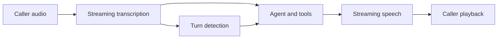

A voice agent listens to you and speaks its reply. Start with a simple browser conversation, then add one behavior at a time. The lessons reuse the same `agent.py`, credentials, and server command.

## From first conversation to a deployed application

1. **[Your first voice agent](/voice/quickstart)**: install, start, and talk. No tools, greeting, or added audio.
2. **[Greetings](/voice/greetings)**: add a fixed hello, then control timing and generated wording.
3. **[Using tools](/voice/tools)**: look up a mock delivery and hear the result.
4. **[Thinking sounds](/voice/thinking-sounds)**, **[spoken fillers](/voice/fillers)**, and **[background audio](/voice/background-audio)**: try each optional sound behavior separately.
5. **[Turn-taking and interruptions](/voice/turn-taking)** and **[silence and timeouts](/voice/silence)**: test how the conversation handles pauses, interruptions, and waiting.
6. **[Recording calls](/voice/recording)**, **[transports and phone calls](/voice/transports)**, and **[events and usage](/voice/observability)**: connect a client or carrier and operate the session.

Use [Providers and configuration](/voice/configuration) as a reference when changing speech providers. Continue to [Custom pipelines](/voice/custom-pipelines) when you need to embed the session or implement an adapter.

## How it works

The built-in pipeline runs a regular Timbal `Agent` between transcription and speech synthesis. It keeps the agent's tools, system prompt, memory, guardrails, and tracing. Speech providers and transports are configured separately from the language model.

The built-in server serves the same agent through text and voice endpoints. Open `/voice` for the browser playground, or connect your own client using WebSocket, WebRTC, LiveKit, or a Twilio/Telnyx media stream.

Keep replies concise and ask one question at a time. Tables, URLs, and long lists are difficult to follow aloud. Start with a conversation you can understand and measure before adding optional behavior.

## Scope of the built-in pipeline

The shipped provider adapters use a transcription → text agent → speech pipeline. `OpenAIRealtimeSTT` is a transcription-only adapter; it does not run the conversation model or synthesize responses.

`RealtimeModel` and `RealtimeSession` define an extension interface for speech-to-speech models. No concrete speech-to-speech provider adapter ships yet, and the built-in server constructs `VoiceSession`. See [Custom pipelines](/voice/custom-pipelines#speech-to-speech-extension-interface) before planning an OpenAI Realtime or Gemini Live integration.

For processing a recorded file, see [Audio files](/examples/agents/audio). For generating an audio file, see [Text-to-speech tools](/examples/agents/tts).
