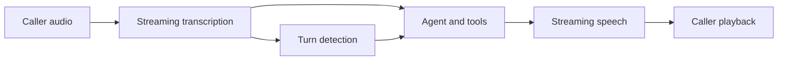

A voice agent listens to a live audio stream, runs a regular Timbal `Agent`, and speaks its response as text arrives. Your agent keeps its tools, system prompt, memory, guardrails, and tracing. Speech providers and transports are configured separately from the language model.

The built-in server serves the same agent through text and voice endpoints. Open `/voice` for the browser playground, or connect your own client using WebSocket, WebRTC, LiveKit, or a Twilio/Telnyx media stream.

<CardGroup cols={2}>
  <Card title="Your first voice agent" icon="microphone" href="/voice/quickstart">
    Install the speech dependencies and speak to an agent in your browser.
  </Card>
  <Card title="Providers and configuration" icon="sliders" href="/voice/configuration">
    Choose transcription, speech output, turn detection, and call behavior.
  </Card>
  <Card title="Clients and phone calls" icon="phone" href="/voice/transports">
    Connect browser clients, LiveKit rooms, and carrier media streams.
  </Card>
  <Card title="Events, usage, and latency" icon="wave-pulse" href="/voice/observability">
    Track transcripts, interruptions, provider usage, recordings, and response time.
  </Card>
  <Card title="Custom pipelines" icon="code" href="/voice/custom-pipelines">
    Use `VoiceSession` directly or implement a speech provider.
  </Card>
</CardGroup>

## Spoken conversations

The session decides when a user has finished speaking, starts an agent turn, and feeds response text to speech synthesis. If the caller interrupts, it cancels the current reply, clears queued playback, and adjusts conversation memory to the estimated or acknowledged portion the caller heard. Accurate playback reporting matters: generated audio and heard audio are different quantities.

Keep spoken replies concise, ask one question at a time, and avoid tables, URLs, or long lists that are difficult to follow aloud. Choose a model and tools based on measured time to the first useful spoken response. A short filler can cover a slow tool call, but still consumes model and speech usage.

## Scope of the built-in pipeline

The shipped provider adapters use a transcription → text agent → speech pipeline. `OpenAIRealtimeSTT` is a transcription-only adapter; it does not run the conversation model or synthesize responses.

`RealtimeModel` and `RealtimeSession` define an extension interface for speech-to-speech models. No concrete speech-to-speech provider adapter ships yet, and the built-in server constructs `VoiceSession`. See [Custom pipelines](/voice/custom-pipelines#speech-to-speech-extension-interface) before planning an OpenAI Realtime or Gemini Live integration.

For processing a recorded file, see [Audio files](/examples/agents/audio). For generating an audio file, see [Text-to-speech tools](/examples/agents/tts).
